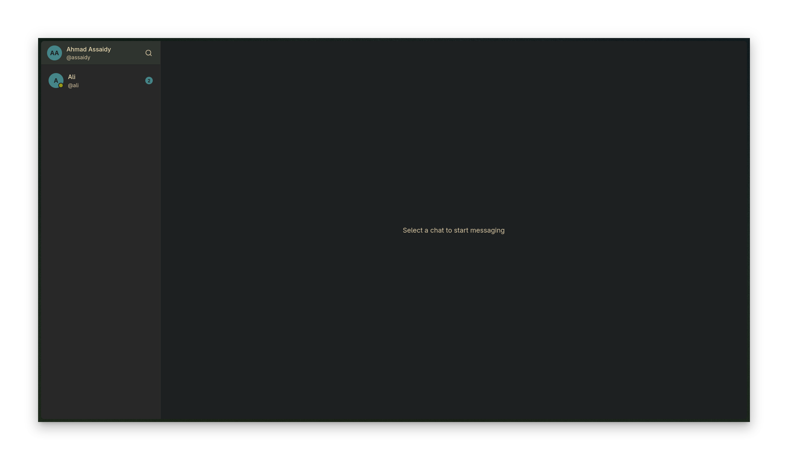
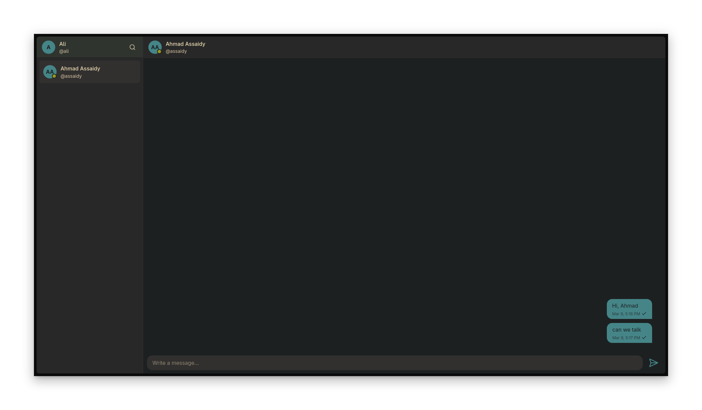
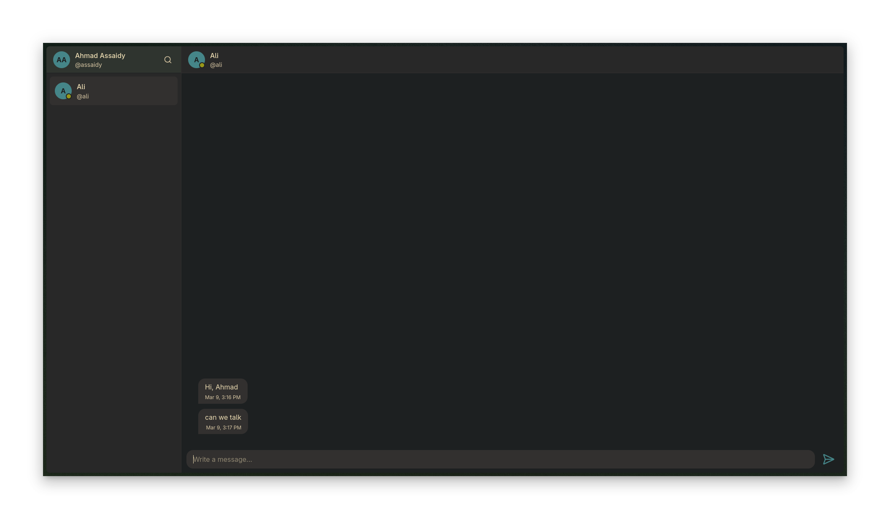
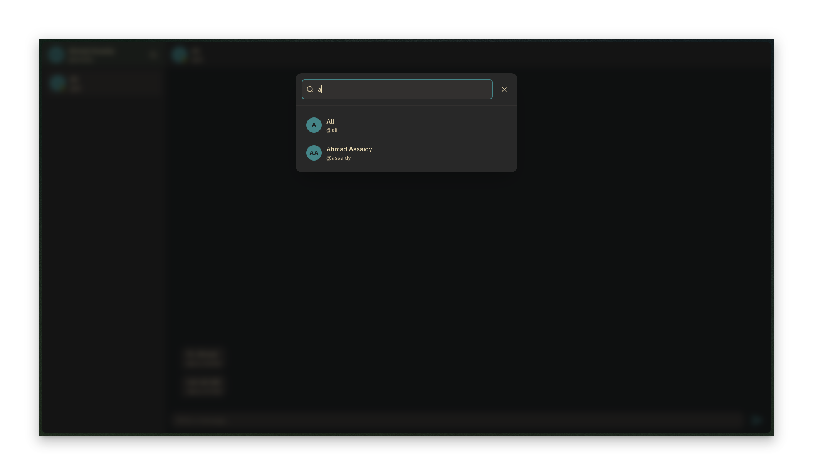
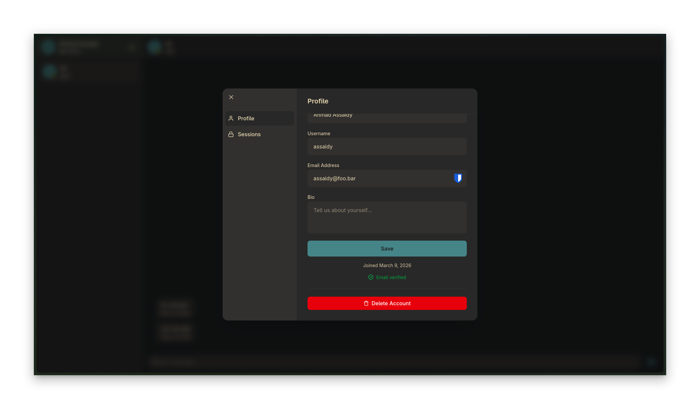
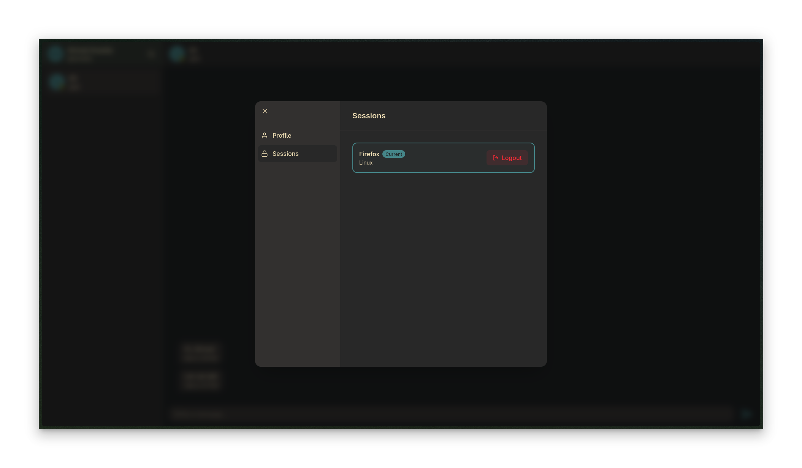
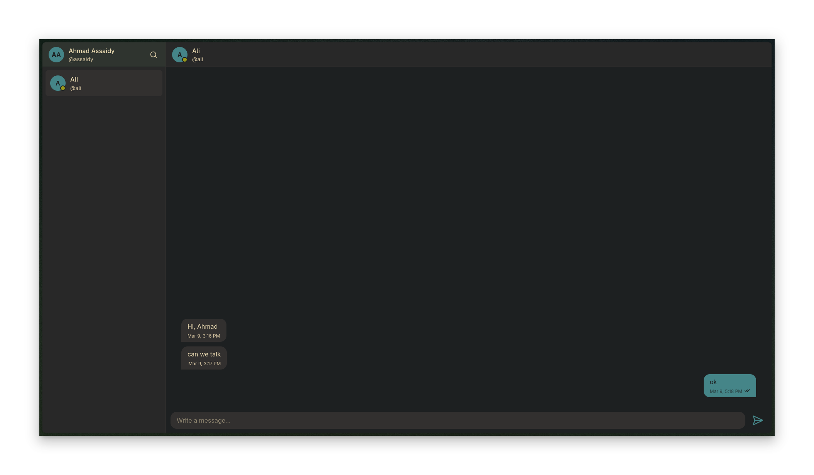

# Blink
Blink Is A Realtime Chat Application.

## Features
- **Load Balancing:** Supports two modes: prefork and load balancing using Docker.
- **Background Workers:** Scheduled tasks to clean up expired sessions, OTPs, and deleted chat messages.
- **User Authentication:** Secure registration, OTP login, and session management.
- **User Profiles:** View and manage user profile information.
- **Real-time Chat:** Instant messaging capabilities across users.
- **Online Presence:** See which users are currently online in real time.
- **Message Status:** Indicators for pending, sent, and read states.
- **Infinite Scrolling:** Seamless loading for chat messages, partners list, and search results.
- **Rate Limiting:** Configured with different rules for various routes to ensure stability.

## Tech Stack
- **Backend:** Go (Fiber v2)
- **Database:** PostgreSQL (with `sqlc` for type-safe queries and `goose` for migrations)
- **Cache & Pub/Sub:** Valkey
- **Frontend:** Hyper (HTML builder), HTMX, and Tailwind CSS
- **Tooling:** Make, Docker (including Docker Compose), sqlc, and goose

## Screenshots

